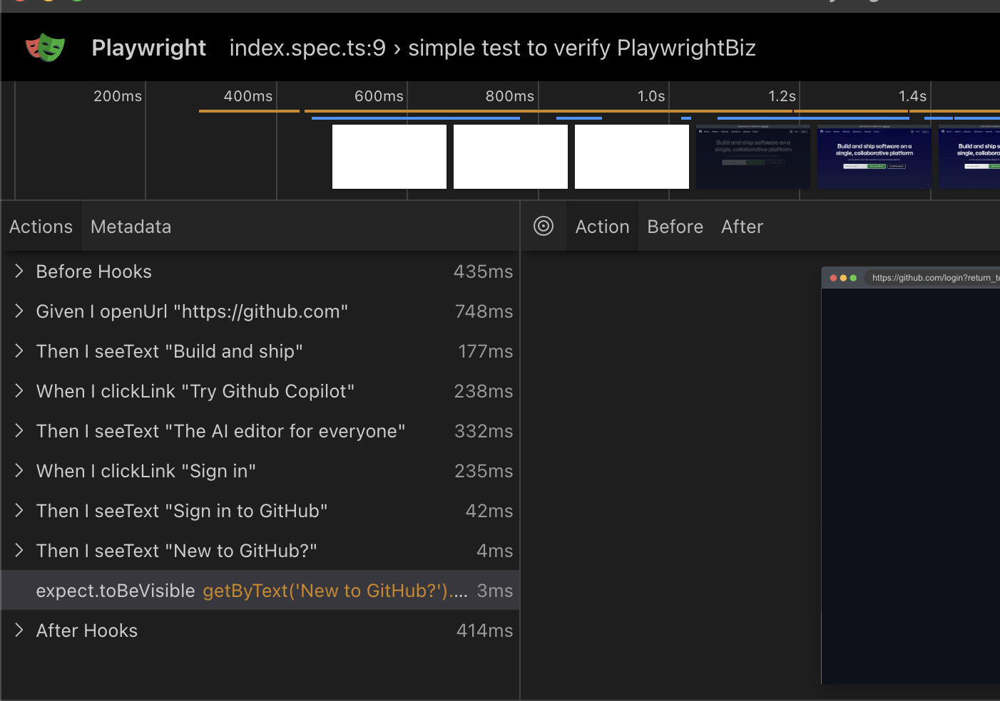

# Talewright

Talewright is a Given-When-Then syntax testing library for Playwright, enabling clear, human-readable end-to-end tests that flow like a story.

## Installation

```sh
npm install talewright
```

## Quick Start

```ts

const test = base.extend<TalewrightFixtures>({
    ...talewrightFixtures(),
});

test("simple test to verify Talewright", async ({ page, When, Given, Then, I }) => {
  await Given.I.openUrl("https://github.com");
  await Then.I.seeText("Build and ship");
  await When.I.clickLink("Try GitHub Copilot");
  await Then.I.seeText("The AI editor for everyone");
  await When.I.clickLink("Sign in");
  await Then.I.seeText("Sign in to GitHub");
  await Then.I.seeText("New to GitHub?");
});
```

## Features
- **Readable syntax**: Write tests like a story using `Given`, `When`, and `Then`
- **Full Playwright support**: Built on top of Playwright’s API
- **Clear assertions**: Use `Then.I.seeText()` and `When.I.clickLink()` for intuitive interactions
- **Creates `test.step()` for each command**: so it is easy to see it in playwrights traceview - so the generated report is similar to the code you write.

## Trace View 



## API

### `Given.I.openUrl(url: string)`
Opens the given URL in a new browser session.

### `Then.I.seeText(text: string)`
Asserts that the specified text is visible on the page.

### `When.I.clickLink(text: string)`
Finds a link containing the given text and clicks it.

### `I.seeText(text: string)`
A shorthand for asserting text presence.

## Contributing
Feel free to submit issues or pull requests on [GitHub](https://github.com/your-repo/talewright).

## License
MIT