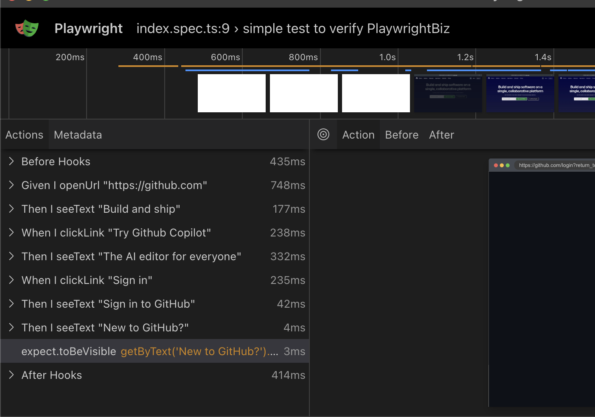

# Talewright

Talewright is a Given-When-Then syntax testing library for Playwright (inspired by [cucumber.io](https://cucumber.io) and [codeceptjs.io](https://codecept.io)), enabling clear, human-readable end-to-end tests that flow like a story.

## Installation

```sh
npm install talewright
```

## Quick Start

```ts
import { test as base } from '@playwright/test';
import { talewrightFixtures, type TalewrightFixtures } from 'talewright';

const test = base.extend<TalewrightFixtures>({
    ...talewrightFixtures(),
});

test("simple test to verify Talewright", async ({ When, Given, Then, I }) => {
  await Given.I.openUrl("https://github.com");
  await Then.I.seeText("Build and ship");
  await When.I.clickLink("Try GitHub Copilot");
  await Then.I.seeText("The AI editor for everyone");
  await When.I.clickLink("Sign in");
  await Then.I.seeText("Sign in to GitHub");
  await Then.I.seeText("New to GitHub?");
  // I is also available directly without a BDD prefix:
  await I.seeText("New to GitHub?");
});
```

## Features

- **Readable syntax**: Write tests like a story using `Given`, `When`, `Then`, `And`, and `But`
- **Full Playwright support**: Built on top of Playwright's API
- **Clear assertions**: Use `Then.I.seeText()` and `When.I.clickLink()` for intuitive interactions
- **Creates `test.step()` for each command**: so it is easy to see it in Playwright's Trace Viewer — making the generated report similar to the code you write
- **Full TypeScript autocomplete**: All `I` methods are fully typed on every BDD fixture

## Trace View



## API

### Exports

| Export | Description |
| ------ | ----------- |
| `talewrightFixtures()` | Returns Playwright fixture definitions to spread into `test.extend()` |
| `TalewrightFixtures` | TypeScript interface for the fixture type parameter |
| `I` | The page-object class — can be imported for custom extension |

### `CommandOptions`

All action and assertion methods accept an optional `CommandOptions` object:

```ts
type CommandOptions = {
  position?: number;  // zero-based index when multiple matching elements exist
  timeout?: number;   // milliseconds to wait (used by waitForElement; default: 5000)
}
```

### BDD Fixtures — `Given`, `When`, `Then`, `And`, `But`

Each BDD fixture exposes `.I.<method>()`. Every call is automatically wrapped in a `test.step()` labelled with the prefix, e.g. `Given I openUrl "https://..."`. In the signatures below `*` stands for any of the five BDD keywords.

#### `*.I.openUrl(url: string)`

Navigates to the given URL.

#### `*.I.clickButton(text: string, options?: CommandOptions)`

Finds a button by its visible text and clicks it.

#### `*.I.clickLink(text: string, options?: CommandOptions)`

Finds a link by its visible text and clicks it.

#### `*.I.clickLabel(text: string, options?: CommandOptions)`

Finds an element by its label and clicks it.

#### `*.I.clickTab(name: string)`

Finds a tab by name and clicks it.

#### `*.I.fillField(label: string, value: string, options?: CommandOptions)`

Finds a text input by its label and fills it with `value`.

#### `*.I.selectOption(label: string, value: string, options?: CommandOptions)`

Finds a dropdown (combobox) by its label and selects `value`.

#### `*.I.checkCheckbox(label: string, options?: CommandOptions)`

Finds a checkbox by its label and checks it.

#### `*.I.uncheckCheckbox(label: string, options?: CommandOptions)`

Finds a checkbox by its label and unchecks it.

#### `*.I.seeText(text: string, options?: CommandOptions)`

Asserts that the specified text is visible on the page.

#### `*.I.dontSeeText(text: string, options?: CommandOptions)`

Asserts that the specified text is **not** visible on the page.

#### `*.I.seeButton(name: string, options?: CommandOptions)`

Asserts that a button with the given name is visible.

#### `*.I.seeHeading(name: string, options?: CommandOptions)`

Asserts that a heading with the given name is visible.

#### `*.I.seePlaceholder(name: string, options?: CommandOptions)`

Asserts that an element with the given placeholder is visible.

#### `*.I.seeInField(label: string, value: string, options?: CommandOptions)`

Asserts that a text input with the given label contains `value`.

#### `*.I.waitForElement(selector: string, options?: CommandOptions)`

Waits for an element matching `selector` to appear. Defaults to a 5000 ms timeout.

### Direct `I` fixture

The `I` fixture exposes the same methods as above but **without** a BDD prefix or `test.step()` wrapping. Use it for utility or helper calls where step labelling isn't needed:

```ts
test("example", async ({ I }) => {
  await I.openUrl("https://example.com");
  await I.seeText("Example Domain");
});
```

You can also import the `I` class directly to extend it with custom actions:

```ts
import { I } from 'talewright';

class MyI extends I {
  async clickAcceptCookies() {
    await this.clickButton("Accept cookies");
  }
}
```

## Contributing

Feel free to submit issues or pull requests on [GitHub](https://github.com/orizens/talewright).

## License

MIT
